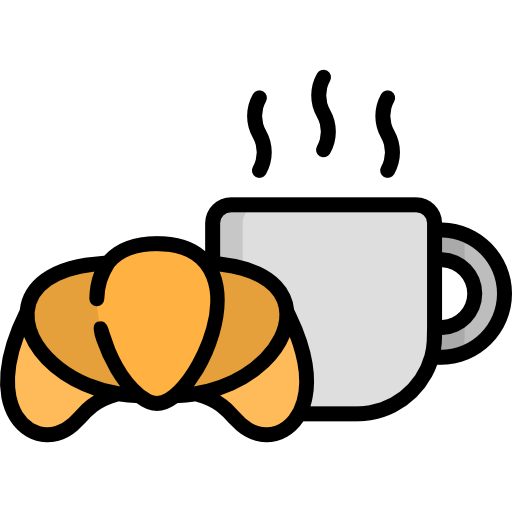

<h1 align="center">betfast</h1>
 

  

 

Breakfast binom builder

(Inspired by this [paper](https://www.improbable.com/news/2012/Optimal-seating-chart.pdf))

# Example

Our objective is to have binoms from different teams.  
The model used here describes the problem by maximizing the number of connections between people.  
So from :

| people | team |
|--------|------|
| Agathe   | team 1 |
| Amandine | team 2 |
| Amélie   | team 1 |
| Edouard  | team 2 |

With build a connection matrix like this one using `data/parse.py` :

|          | Agathe | Amandine | Amélie | Edouard |
|----------|--------|----------|--------|---------|
| Agathe   | 0      | 1        | 0      | 1       |
| Amandine | 1      | 0        | 1      | 0       |
| Amélie   | 0      | 1        | 0      | 1       |
| Edouard  | 1      | 0        | 1      | 0       |

Then we use a open source solver to reach an optimal solution :

|   |   |
|---|---|
| dej 1 | <ul><li>Agathe</li><li>Edouard</li></ul> |
| dej 2 | <ul><li>Amandine</li><li>Amélie</li></ul> |

Enjoy your breakfast :coffee:
